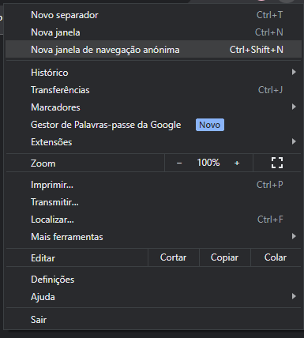
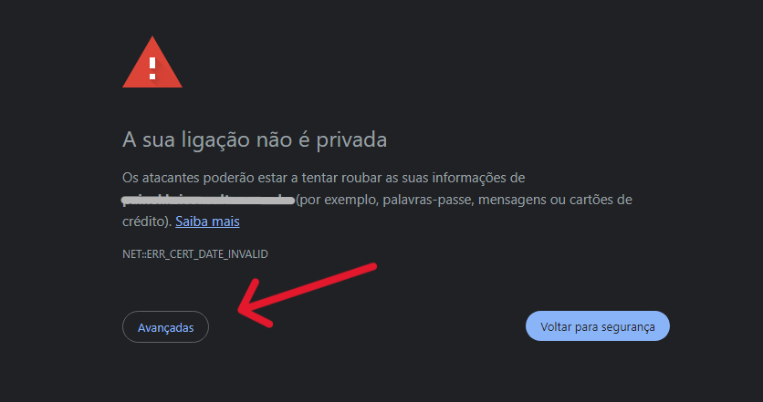
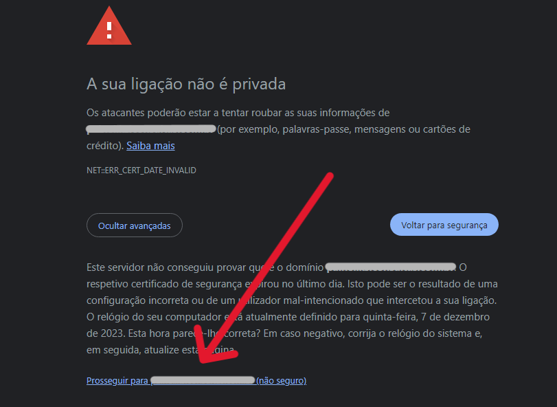

# Revolvendo error de Acesso Inseguro

## 1. Abra o navegador e abra uma guia anomima 

---------------------------------------

## 2. Abra o sistema nessa guia anomima e va na opção **Avançadas**

## 3. Cliente em prosseguir para o site 

## agora navegue e seja feliz

#ByGio404
